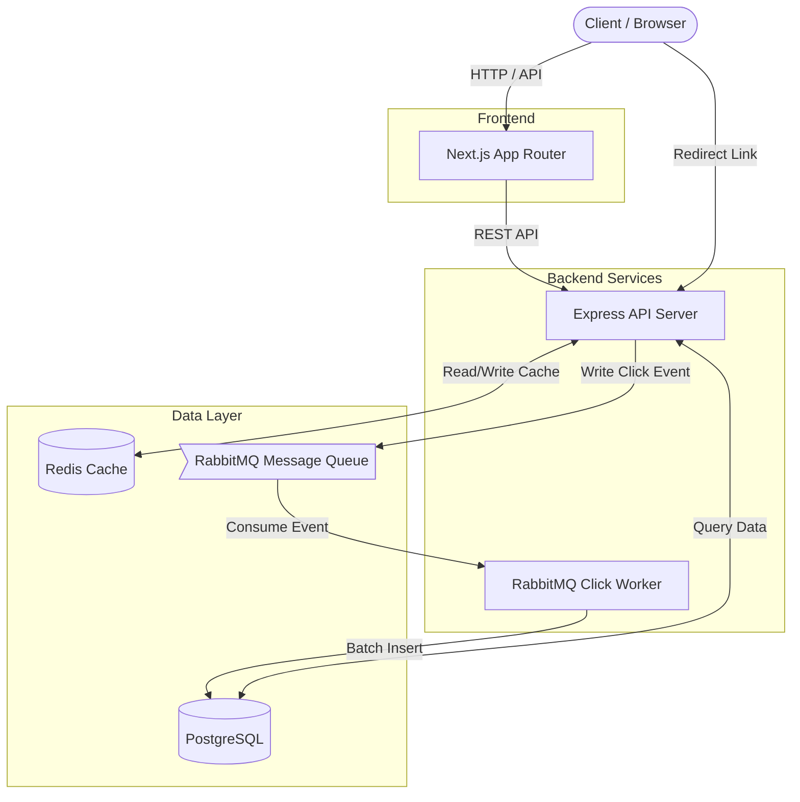

# ⚡ Sniplink — Distributed URL Shortener

A blazing-fast, production-grade URL shortener built for scale. Features real-time analytics, Redis caching, and asynchronous event processing via RabbitMQ.

## 🚀 Architecture



## 🛠️ Tech Stack

| Component | Technology | Purpose |
|-----------|------------|---------|
| **Frontend** | Next.js (App Router), React, Recharts | Server-rendered UI, dashboard, and analytics charts |
| **Backend API** | Node.js, Express, TypeScript | REST API, URL redirection, authentication |
| **Database** | PostgreSQL, Prisma ORM | Persistent storage for users, URLs, and analytics |
| **Caching** | Redis | Caching URL lookups, sliding-window rate limiting |
| **Message Queue** | RabbitMQ | Asynchronous processing of click analytics |
| **Testing** | Vitest, Supertest | Integration and unit testing |
| **DevOps** | Docker, Docker Compose | Containerization for local dev and deployment |

## 🔑 Key Engineering Decisions

1. **Redis Caching:** URL lookups are cached to ensure sub-millisecond redirect times. We also use *negative caching* (caching 404s) to prevent database hammering on invalid links.
2. **Asynchronous Analytics:** Every time a user clicks a short link, we don't write to the database immediately. Instead, we publish an event to RabbitMQ. A separate background worker consumes these events and inserts them into PostgreSQL. This keeps the redirect endpoint extremely fast and responsive under load.
3. **Sliding-Window Rate Limiting:** Implemented via custom Redis Lua scripts to provide precise rate limiting for API endpoints (e.g., max 10 URL creations per minute).
4. **JWT Token Rotation:** Access tokens (short-lived) and Refresh tokens (long-lived, hashed in DB). Includes reuse detection to revoke token families if a refresh token is stolen.

## 💻 Running Locally (with Docker)

The easiest way to run the entire stack (PostgreSQL, Redis, RabbitMQ, API, and Worker) is using Docker Compose.

```bash
# 1. Clone the repository
git clone https://github.com/yourusername/distributed-url-shortener.git
cd distributed-url-shortener

# 2. Start all backend services
docker-compose up -d

# 3. Start the frontend
cd frontend
npm install
npm run dev
```

The frontend will be available at `http://localhost:3001` and the backend at `http://localhost:3000`.

## 🧪 Testing

```bash
cd backend
npm test
```

## 🌐 API Endpoints Overview

| Method | Endpoint | Description | Auth |
|--------|----------|-------------|------|
| GET | `/:shortCode` | Redirects to the original URL | No |
| POST | `/api/auth/register` | Create a new user | No |
| POST | `/api/auth/login` | Authenticate user | No |
| GET | `/api/auth/me` | Get current user info | Yes |
| GET | `/api/urls` | List user's shortened URLs | Yes |
| POST | `/api/urls` | Create a new short URL | Yes |
| GET | `/api/analytics/:id` | Get detailed click stats | Yes |
